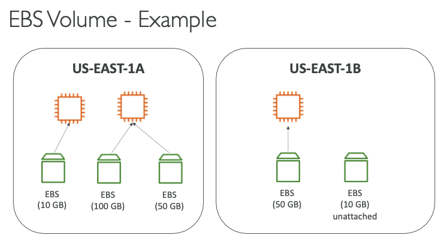
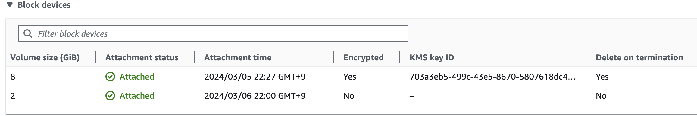
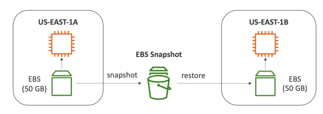
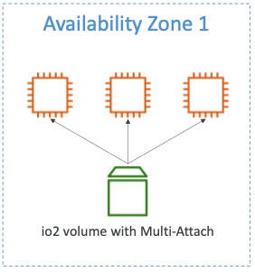
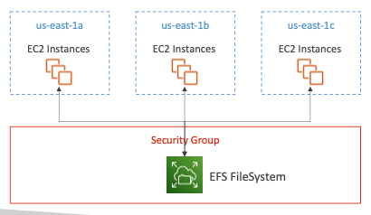

# EBS & Snapshot

---

**EBS ( Elastic Block Store ) Volume**

- 인스턴스가 실행 중인 동안 연결 가능한 네트워크 드라이브
    - 인스턴스와 연결을 위해서는 네트워크가 필요함
    - 네트워크 사용으로 다른 서버에 도달할 때 지연이 생길 수 있음
    - EC2 인스턴스에서 분리 가능하며 다른 인스턴스로 연결 가능
- **EBS 볼륨을 사용하면 인스턴스가 종료된 후에도 데이터 지속 가능**
- CCP 레벨 : 하나의 EBS는 하나의 EC2 인스턴스에만 마운트 가능
- Asociate 레벨 : 일부 EBS 다중 연결 가능
- EBS 볼륨 생성은 **특정 가용 영역에서만** 가능
    - ex ) EBS 볼륨이 us-east-1a에서 생성된 경우 us-east-1b에는 연결 불가능
    - 스냅샷을 이용하면 다른 가용 영역으로도 볼륨 옮길 수 있음
- 볼륨이기 때문에 용량을 미리 결정해야 함
    - GB, IOPS(단위 초당 전송 수)
- EBS를 만들어도 인스턴스와 연결하지 않아도 됨

**EBS 스냅샷**

- EBS 볼륨의 **특정 시점에 대한 백업**
- EC2 인스턴스에서 EBS 볼륨을 분리하는 것이 권장 사항
- EBS 스냅샷은 다른 AZ이나 다른 Region에 복사 가능
- ex ) 1A에 있는 EBS 볼륨 EC2 인스턴스가 있고 1B에 있는 ECE 인스턴스가 있을 때 1A에 있는 EBS 볼륨에 대한 스냅샷을 찍고 1B에 복원 가능

  

**스냅샷 특징**

- EBS 스냅샷 아카이브
    - 복원하는 데 24 to 72시간 걸림
    - 즉시 복원 X
- EBS 스냅샷 휴지통
    - 스냅샷을 삭제하는 경우 영구 삭제하는 대신 **휴지통에 넣을 수 있음**
    - **휴지통에서 복원 가능**
    - 보관 기간은 1일에서 1년 사이로 설정 가능
- FSR(Fast Snapshot Restore) - 빠른 스냅샷 복원
    - 스냅샷을 완전 초기화해 첫 사용에서의 지연 시간을 없애는 기능
    - 스냅샷이 아주 클 때
    - EBS 볼륨 또는 EC2 인스턴스를 빠르게 초기화해야 할 때 유용
    - 대신 비용이 많이 든다

## AMI (Amazon Machine Image)

- EC2 이미지를 통해 만든 이미지
- **특정 AWS 리전에 국한됨**
- 원하는 소프트웨어 또는 설정파일 추가 / 운영체제 / 모니터링 툴 추가 가능
- AMI를 따로 구성하면, 부팅 및 설정에 드는 시간 절약가능(EC2 인스턴스에 설치하고자 하는 모든 소프트웨어를 AMI가 미리 패키징해주므로)
- us-east-1a에 있는 인스턴스를 실행하고 설정을 변경한 다음, 거기서AMI를 만듬 (사용자지정AMI)
    - 그 다음 이 AMI에서 us-east-1b를 실행(그러면 이 안에 EC2 인스턴스의 복사본이 생성됨)

## EC2 Instance Store

- EC2 인스턴스는 가상머신 이지만 실제로는 하드웨어 서버에 연결되어 있다.

⇒ 이 하드웨어 서버에 물리적으로 연결된 디스크 공간을 갖는다.

⇒ 따라서 특정 유형의 EC2 인스턴스는 EC2 인스턴스 스토어 라고 불리며 이는 해당하는 물리적 서버에 연결된 하드웨어 드라이브를 가리킨다.

- I/O 향상을 위해 활용 ( 향상된 디스크 성능이 필요할 때)
- 주의점
    - EC2 인스턴스를 중지 또는 종료하면 해당 스토리지 또한 손실됨
    - 그래서 임시(ephemeral) 스토리지 라고도 불림
    - 즉, 장기적으로 사용하기엔 좋지않음
- 버퍼, 캐시, 스크래치 데이터, 임시컨텐츠 등 단기적인 데이터에 적합
- 장기데이터는 EBS가 적합하다.

**EBS Volume Types**

- **gp2** / gp3
    - **범용 SSD 볼륨**
    - 부팅볼륨, 루트 OS가 실행될 위치에 해당
    - 다양한 워크로드에 대해 적절한 가격과 성능
- **io1 / io2**
    - **최고의 성능 SSD 볼륨**
    - 부팅 볼륨, 루트 OS가 실행될 위치에 해당
    - 처리가 빨라서 중요하고 **대용량 워크로드**에 쓰임
- st1
    - 저비용 HDD 볼륨
    - 자주 접근하고 적은 처리량의 워크로드에 쓰임
- sc1
    - 가장 비용이 적게 드는 HDD 볼륨
    - 접근 빈도가 낮은 워크로드에 사용

gp2(⭐️)

- 짧은 지연 시간
- 효율적인 비용의 스토리지
- 시스템 부팅 볼륨에서 가상 데스크톱, 개발, 테스트 환경에서 사용
- 1GB에서 16TB까지 다양한 크기
- 최대 3,000 IOPS
- 볼륨과 IOPS 연결되어 있음
    - 볼륨의 GB를 늘리면 세 배 더 증가한 IOPS가 된다는 의미
    - 예로 5,334GB라면 최대 용량인 16,000 IOPS를 초과하는 상황 발생

**gp3**

- 최신 세대의 볼륨
- 기본 성능으로 3,000 최대 16,000 IOPS ( 초당 I/O 작업량 )
- 초당 125MB 처리량, 최대 1,000MB
- 볼륨과 IOPS가 연결되어있지 않음

**io2**

- io1과 동일한 비용으로 내구성과 기기 당 IOPS가 더 높음
- 4GB에서 64TB
- 고성능 유형의 볼륨
- 지연 시간이 밀리초 미만
- IOPS와 GB 비율이 1,000:1일 때, 최대 256,000 IOPS

**st1**

- 이전 세대의 볼륨
- 부팅 볼륨일 수 없음
- 최대 16TB까지 확장
- 처리량 최적화 HDD
- 빅데이터나 데이터웨어하우징 로그 처리에 적합
- 최대 처리량은 초당 500MB, 최대 500 IOPS

**sc1**

- 이전 세대의 볼륨
- 부팅 볼륨일 수 없음
- 최대 16TB까지 확장
- 콜드 HDD
- 아카이브 데이터용
- 접근 빈도 낮고 최저 비용으로 데이터 저장시 적합
- 최대 처리량 초당 250MB, 최대 250 IOPS

Provisioned IOPS ( PIOPS ) → io1, io2(⭐️)

- **IOPS 성능 유지가 필요한 주요 비지니스 애플리케이션에 적합**
- **16,000 IOPS 이상**을 필요로하는 애플리케이션에 적합
- 일반적으로 **데이터베이스 워크로드에 알맞음**
- 스토리지 성능과 일관성에 아주 민감
- 4에서 16TB까지 있음
- Nitro EC2 인스턴스에서는 최대 64,000 IOPS까지 가능
- 그 외의 경우는 32,000 IOPS까지 지원
- io1/io2를 이용하면 gp3 볼륨처럼 프로비저닝된 IOPS를 스토리지 크기와 독자적으로 증가 가능
- @32,000 IOPS 이상을 요할 때에는 io1 또는 io2 볼륨의 EC2 Nitro가 필요

**EBS Multi - Attach**

- **하나의 EBS 볼륨**을 **같은 AZ에 있는 여러 EC2 인스턴스에** 연결할 수 있게 해주는 것
- EBS 볼륨 중 io1과 io2 제품군에서만 사용 가능
  - 각 인스턴스는 읽기 및 쓰기 권한 전부 얻음
    
    
- 애플리케이션 가용성을 높이기 위해 Teradata처럼 클러스팅된 Linux 애플리케이션에서 사용하거나 애플리케이션이 동시 쓰기 작업을 관리해야 할 때 사용
- 해당 가용 영역 내에서만 사용 가능
- 한 번에 **16개**의 EC2 인스턴스만 같은 볼륨에 연결 가능 (⭐️)
- 다중연결을 사용하려면 반드시 클러스터 인식 파일 시스템 사용해야함

**EBS 암호화(encryption)**

- 저장 데이터가 볼륨 내부에 암호화
- 인스턴스와 볼륨 간의 전송 데이터 암호화
- 스냅샷 뿐만 아니라 스냅샷으로 생성한 볼륨도 암호화
- **암호화 되지 않은 볼륨에서는 스냅샷도 암호화 안됨**
    - 단, 스냅샷 복사할 때 암호화 활성화 하면 됨
    - **복사 된 스냅샷에서 볼륨 생성하면 그 볼륨도 암호화**
- 지연 시간에 영향 거의 없음
- KMS에서 암호화 키를 생성해 AES-256 암호화 표준을 가짐
1. 볼륨의 EBS 스냅샷 생성
2. 복사 기능을 통해 EBS 스냅샷 암호화
3. 스냅샷을 이용해 새 EBS 볼륨을 생성, 해당 볼륨도 암호화 됨
4. 암호화된 볼륨을 인스턴스 원본에 연결

## EFS (Elastic File System)

- EFS는 NFS (network file system) - 관리형 파일 시스템
- 가용성이 높고 확장성이 뛰어나지만 비싸다.
- EFS를 통해 **다른 AZ에 있는 인스턴스들을 동일한 네트워크 파일 시스템에 동시 연결 가능**
- EFS는 자동으로 확장되며 사용하는 데이터 사용량에 따라 비용 지불

## EFS 옵션(⭐️)

- Performance mode
    - General Purpose(default) : 이 모드는 지연 시간에 민감한 사용 사례에 사용됨(웹 서버, CMS 등)
    - Max I/O : 처리량을 최대화하려면 최대 I/O 모드를 선택(지연 시간이 더 긴 네트워크 파일 시스템이지만, 처리량이 높고 병렬성이 높다)
- Throughput Mode (처리량 모드)
    - Bursting
    - Provisioned - 스토리지 관계없이 처리
    - Elastic - 워크로드에 따라 처리량 자동조절