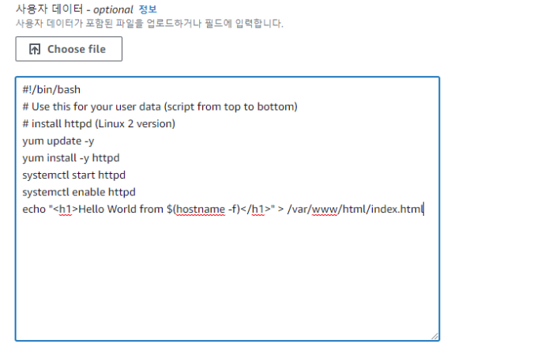

# EC2

## EC2(Elastic Compute Cloud)

- AWS에서 제공하는 Infrastructure as a Service
- 주요 기능
    - Renting virtual Machine (EC2) - 가상머신을 ec2에서 빌림
    - Storing data on virtual drives (EBS)
    - Distributing load across machine (ELB)
    - Scaling the services using an auto-scaling group (ASG)
- EC2 사용법을 아는 것은 **클라우드 작동 방식을 이해할 때 필수적**
    - 클라우드는 필요할 때마다 가상 공간을 언제든지 활용 가능한데 EC2가 그 예시

**EC2 옵션**

- OS : Windos, Mac OS, **Linux**
- CPU : How much compute power & cores - 이 가상머신에 사용할 컴퓨팅 성능과 코어의 양(CPU갯수)
- RAM : How much random-access memory - 랜덤 액세스 메모리의 양
- Storage space - 네트워크를 통해 연결할 스토리지의 필요여부
    - Network-attached (EBS & EFS)
    - Hardware (EC2 Instance Store)
- Network card : Speed of the card, Public IP address - EC2 인스턴스에 연결할 네트워크의 종류
- Firewall rules : security group
- Bootstrap script (configure at first launch) : EC2 User Data

**EC2 Instance 생성**

1. EC2 > Instances > Launch instances
2. Instance 생성( 이름, OS, 이미지, 인스턴스 유형, 키 페어 등 선택 )
3. 하단에 있는 User data는 EC2를 첫 번째 생성할 때 실행되는 명령어를 입력할 수 있음

1. Summary에서 EC2 스펙 확인
    

    
2. 인스턴스 생성까지 10~15초가 걸린다. (이것이 클라우드의 힘) 즉 서버를 보유하고 있지 않아도 바로 생성 가능하다.

## 인스턴스 정보

- 인스턴스 ID : 고유 식별자
- 퍼블릭 IPv4 : EC2 인스턴스에 접근하기 위해 사용할 주소
- 프라이빗 IPv4 : AWS 네트워크에서 내부적으로 인스턴스에 접근하는 주소

## 인스턴스 실행 및 중지

- 계속 실행하면 지불해야 하는 금액도 증가하므로 미사용시엔 중지할것
- 재실행 시 퍼블릭 IPv4 주소가 변경 됨, 프라이빗은 변경 X

## EC2 인스턴스 타입

- 각 조건에 맞는 EC2 인스턴스 확인 가능
- 각 스펙이나 요금 등을 비교할 수 있음

- AWS 제품 이름 설정 규칙
    - ex) m5.2xlarge
    - m : Instance class (general instance)
    - 5 : Generation
    - exlarge : Instance size, 클수록 인스턴스에 더 많은 메모리와 CPU를 가지게 됨
    
    ## 인스턴스 최적화 유형 (시험 관련)
    
    1. General Purpose (범용 인스턴스)
        - 웹 서버나 코드 저장소와 같은 다양한 작업에 적합
        - 컴퓨팅, 메모리, 네트워킹 간의 **균형이 잘 맞음**
            - ex) t2.micro
    2. Compute Optimized (컴퓨팅 최적화 인스턴스)
        - 컴퓨터 고성능 작업에 적합
        - 데이터 일괄 처리
        - 미디어 트랜스코딩
        - 고성능 웹 서버
        - HPC 작업
        - 머신 러닝
        - 전용 게임 서버 등
        - 인스턴스 이름이 ‘C’로 시작하는 이름을 가짐 ex) C5, C6
    3. Memory Optimized (메모리 최적화 인스턴스)
        - 메모리에서 대규모 데이터 셋을 처리하는 작업에 적합
        - 고성능의 관계형 또는 비관계형 데이터 베이스
        - 분산 웹스케일 캐시 저장소
        - BI (Business Inteligence) 에 최적화된 In-memory 데이터베이스
        - 대규모 비정형 데이터의 실시간 처리를 실행하는 어플리케이션
        - 인스턴스 이름이 주로 RAM을 나타내는 ‘R’로 시작 ex) R6g, R5, R5a
        - 하지만 X1이나 대용량 메모리인 Z1도 있다.
    4. Storage Optimized (스토리지 최적화 인스턴스)
        - 로컬 스토리지에서 대규모 데이터셋에 접근할 때 적합
        - High Frequency Online Transaction Processing(OLTP)시스템
        - 관계형과 비관계형 NoSQL 데이터베이스
        - 메모리 데이터베이스의 캐시 ex) Redis
        - 데이터 웨어하우징 어플리케이션
        - 분산 파일 시스템
        - ~~인스턴스 이름이 ‘I’, ‘G’, ‘H1’으로 시작~~
        
        ## 인스턴스 유형 별 비교
        
        - t2.micro에는 vCPU 1개, 1GB의 메모리
        - r5.10xlarge에는 vCPU 64개, 512GB 메모리
            - 상대적으로 메모리가 중요함 을 알 수 있음
        - cd5.4xlarge에는 vCPU 16개, 32GB 메모리
        - 메모리나 CPU 등 네트워크 성능에 따라 EBS 대역폭 등이 달라짐

#### Q_1) 다음 중, 할인 폭이 가장 크나, 데이터베이스 혹은 중요 업무에는 적합하지 않은 EC2 구매 옵션은 무엇인가요? ####
	 a. 전환 가능 예약 인스턴스
     b. 전용 호스트
     c. 스팟 인스턴스

#### Q_2) EC2 인스턴스 내/외의 트래픽을 제어하기 위해서는 무엇을 사용해야 하나요? ####
	a. 네트워크 엑세스 제어 리스트(NACL)
    b. 보안 그룹
    c. IAM 정책

#### Q_3) IEC2 예약 인스턴스를 예약할 수 있는 기간은 얼마인가요? ####
	a. 1년, 혹은 3년
    b. 2년, 혹은 4년
    c. 6개월, 혹은 1년
    d. 1년에서 3년 사이의 기간

#### Q_4) EC2 인스턴스에 고성능 컴퓨팅(HPC) 애플리케이션을 배포하려 합니다. 다음 중 어떤 EC2 인스턴스 유형을 선택해야 할까요? ####
	a. 스토리지 최적화
    b. 컴퓨팅 최적화
    c. 메모리 최적화    
    d. 범용

#### Q_5) 1년 간 지속적으로 서버를 운영할 계획인 애플리케이션의 경우에는 다음 중 어떤 EC2 구매 옵션을 사용해야 할까요? ####
	a. 예약 인스턴스
    b. 스팟 인스턴스
    c. 온디맨드 인스턴스

#### Q_6) 일련의 EC2 인스턴스에 호스팅 될 애플리케이션을 실행하려 합니다. 이 애플리케이션에는 소프트웨어 설치가 필요하며, 최초 실행 중에 일부 OS 패키지를 업데이트해야 합니다. EC2 인스턴스를 실행하려는 경우, 이를 위한 최적의 방식은 무엇일까요? ####
	a. SSH를 통해 각 EC2 인스턴스에 연결한 후, 필수 소프트웨어를 설치하고 OS 패키지를 수동으로 업데이트하기
    b. 필수 소프트웨어의 설치 및 OS 업데이트를 수행하는 bash 스크립트를 작성한 후, AWS 지원 센터에 연락해 스크립트 제공하기 (이들은 EC2 인스턴스 실행할 때 인스턴스에서 실행)
    c. 필수 소프트웨어의 설치 및 OS 업데이트를 수행하는 bash 스크립트를 작성한 후, 이 스크립트를 EC2 인스턴스 실행 시에 EC2 사용자 데이터에서 사용하기

#### Q_7) 인메모리 데이터베이스를 사용하는 중요 애플리케이션을 위해서는 다음 중 어떤 EC2 인스턴스 유형을 선택해야 할까요? ####
	a. 컴퓨팅 최적화
    b. 스토리지 최적화
    c. 메모리 최적화
    d. 범용

#### Q_8) 온프레미스에 호스팅된 OLTP 데이터베이스를 갖춘 전자 상거래 애플리케이션이 있습니다. 이 애플리케이션은 인기가 좋아, 데이터베이스가 초당 수천 개의 요청을 지니게 됩니다. 여러분은 데이터베이스를 EC2 인스턴스로 이전하려 합니다. 이렇게 높은 빈도를 보이는 OLTP 데이터베이스를 처리하기 위해서는 어떤 EC2 인스턴스 유형을 선택해야 할까요? ####
	a. 컴퓨팅 최적화
    b. 스토리지 최적화
    c. 메모리 최적화
    d. 범용

#### Q_9) 보안 그룹은 오직 하나의 EC2 인스턴스에만 연결될 수 있습니다. ####
	a. 참
    b. 거짓

#### Q_10) 온프레미스 애플리케이션을 AWS로 이전하려 합니다. 여러분의 기업에는 애플리케이션을 전용 서버에서 실행해야 한다는 엄격한 규정이 있습니다. 또한 비용 절감을 위해 전용 서버 바운드 소프트웨어 라이선스를 사용해야 합니다. 이 경우, 다음 중 어떤 EC2 구매 옵션이 적합할까요? ####
	a. 전환 가능 예약 인스턴스컨버터블 예약 인스턴스
    b. 전용 호스트
    c. 스팟 인스턴스

#### Q_11) 데이터베이스 기술을 EC2 인스턴스에 배포하려 합니다. 공급 업체 라이선스는 물리적 코어 및 기반 네크워크 소켓 가시성를 기반으로 비용을 책정합니다. 이 경우, 어떤 EC2 구매 옵션을 사용해야 가시성을 확보할 수 있을까요? ####
	a. 스팟 인스턴스
    b. 온디맨드
    c. 전용 호스트
    d. 예약 인스턴스

#### 정답 및 해설 #### 
Q_1. (c)
스팟 인스턴스는 단기적인 워크로드에 적합하며, 가장 저렴한 EC2 구매 옵션입니다. 하지만 EC2 인스턴스를 손실할 우려가 있기 때문에, 신뢰도가 떨어집니다.

Q_2. (b)
보안 그룹은 EC2 인스턴스 레벨에서 운용되며, 트래픽을 제어할 수 있습니다.

Q_3. (a)
EC2 예약 인스턴스는 1년, 혹은 3년의 기간으로만 예약이 가능합니다.

Q_4. (b)
컴퓨팅 최적화 EC2 인스턴스는 고성능 프로세서(예: 배치 처리, 미디어 트랜스코딩, 고성능 컴퓨팅, 과학적 모델링 및 머신 러닝, 전용 게이밍 서버 등)가 필요한 집중 컴퓨팅 워크로드에 적합합니다.

Q_5. (a)
예약 인스턴스는 장기적인 워크로드에 적합합니다. EC2 인스턴스는 1년, 혹은 3년의 기간으로 예약할 수 있습니다. 하지만 곧 사라질 예정으로 절약 인스턴스로 대체

Q_6. (c)
EC2 사용자 데이터는 bash 스크립트를 사용해 EC2 인스턴스를 부트스트랩 할 경우에 사용됩니다. 이 스크립트에는 소프트웨어/패키지 설치, 인터넷에서 파일 다운로드 등, 여러분이 원하는 작업을 수행하기 위한 명령어를 포함시킬 수 있습니다.

Q_7. (c)
메모리 최적화 EC2 인스턴스는 메모리에 대규모 데이터 세트가 필요한 워크로드에 적합합니다.

Q_8. (b)
스토리지 최적화 EC2 인스턴스는 로컬 스토리지의 대규모 데이터 세트에 대해 높은 수준의, 그리고 순차적인 읽기/쓰기 액세스 권한이 필요한 워크로드에 적합합니다.

Q_9. (b.거짓)

Q_10. (b)
전용 호스트는 높은 수준의 규정 준수가 필요한 기업, 혹은 복잡한 라이선스 모델을 가진 소프트웨어에 적합합니다. 이는 가장 비싼 EC2 구매 옵션입니다.

Q_11. (b)