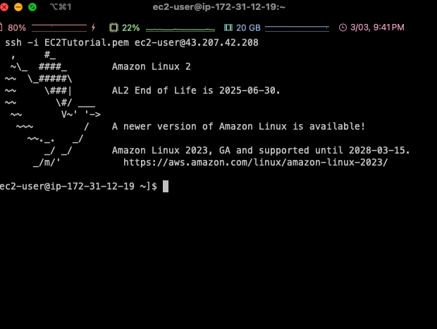
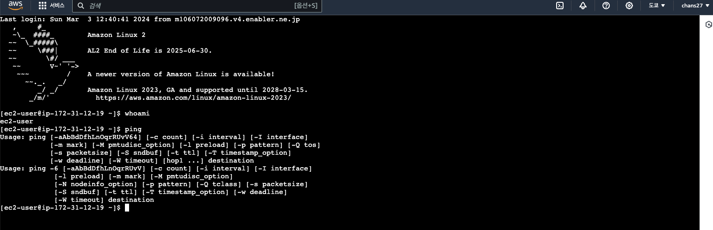
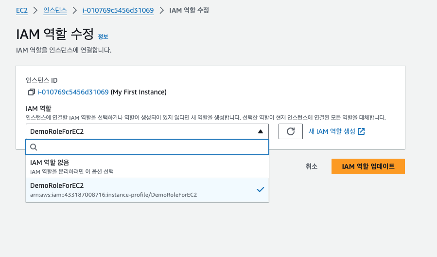
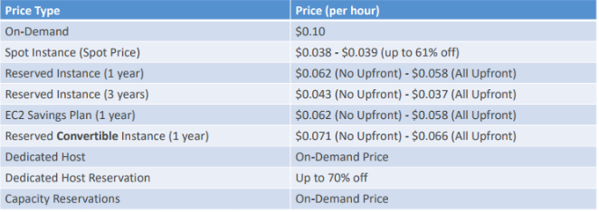
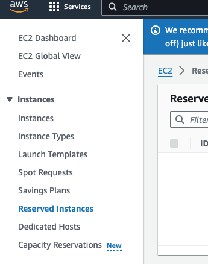

# SSH & EC2 연결

### SSH란?

- CLI로 원격 머신을 제어할 수 있게 해주는 것

### SSH Connect

1. EC2Tutorial.pem이 있는 디렉토리로 변경
2. SSH 명령 입력
    - ssh -i '.\EC2 Tutorial.pem' ec2-user@퍼블릭IP

### EC2 Instance Connect

- Instance → 위쪽의 Connect → 인스턴스에 연결
- 브라우저 기반으로 EC2 인스턴스에 대한 SSH 세션 실행 가능
- 유저이름 ec2-user는 기본값으로 제공되는 이름
    
    
    
- CLI같은 것들을 사용하지 않고 실행하므로 편리함

### EC2 인스턴스를 위한 IAM 역할

- 처음에 ‘aws iam list-users’를 입력하면 자격 증명이 없어서 실행 안됨
- 자격 증명을 IAM을 통해 부여해준다.
1. EC2 인스턴스에 연결
    - Amazon Linux AMI는 AWS CLI를 포함하고 있음
    - 'aws configure' 명령을 통해 EC 인스턴스에 상세 개인 정보( 엑세스 키 ID, PW 등) 입력하는 것은 좋지 않음
    - 해당 계정 사용자들이 EC2 인스턴스 커넥트를 통해 해당 정보를 확인할 수 잇기 때문
    - 대신 사용할 수 있는게 IAM
2. EC2 콘솔 > instance > Action > Security > Modify IAM role
3. DemoRoleForEc2 선택 후 업데이트
    
    
    
4. ‘aws iam list-users’ 입력하면 user 정보 확인 가능

**EC2 인스턴스 구매 옵션**

1. EC2 On Demend
    - 필요한 대로 인스턴스 실행 가능
    - **단기적인 워크로드**에 사용하기 좋음
    - 사용한 대로 지불
    - 비용이 가장 많이 들지만 바로 지불하는 것이 아님
    - 단기적이고 중단 없는 워크로드가 필요할 때, 애플리케이션의 작동 상황을 에상할 수 없을 때
2. EC2 Reserved Instances(1&3 years) - 예약 인스턴스
    - **장기간 데이터베이스를 실행할 계획**이라면 좋음
    - 온디맨드에 비해 약 70% 할인 제공
    - 인스턴스 타입, Region, Tenancy, OS 등을 예약
    - 부분 선결제 or 선셜제
    - **사용량이 일정한** 애플리케이션 ( database ) 등에 사용
    - 마켓플레이스에서 사고 팔 수 있음
3. Convertible Reserved Instance - (전환형 예약 인스턴스)
    - 인스턴스 타입, 인스턴스 패밀리, OS, 범위, Tenancy 변경 가능
    - 유연성이 크므로 할인이 적음, 최대 66%
4. Saving Plans (1&3years)
    - **장기간 워크로드**를 위한 것
    - 70% 할인 가능
    - **사용량이 한도를 넘어가면 온디맨드 가격으로 청구**
    - 특정한 인스턴스와 패밀리, Region으로 고정
        - ex) M5 타입의 인스턴스 패밀리, us-east-1을 원한다면 인스턴스 사이즈는 유연하기 때문에 m5.xlarge, m5.2xlarge 등을 선택 가능 OS는 Linux나 Windows 등으로 전환 가능
5. Spot Instance
    - **아주 짧고 저렴함, 하지만 인스턴스 손실 가능성이 있어 신뢰성이 낮음**
    - 온디맨드에 비해 최대 90%까지 할인 가능
    - 지불하려는 최대 가격을 정의, 만약 그 가격을 넘어가게 되면 인스턴스 손실
    - 배치 작업
    - 데이터 분석
    - 이미지 처리
    - 분산형 워크로드
    - 시작과 종료 시간이 유연한 워크로드
    - **중요한 작업이나 데이터베이스에는 적절하지 않음 (시험에 출제)**
    - 스팟 요청을 취소 후, 스팟 인스턴스 종료해야 함
    - 스팟 플릿, 한 세트의 스팟 인스턴스에 온디맨드 인스턴스를 조합해 사용하는 방식
        - LowestPrice, Diversfiled, CapacityOptimized
        - 사용하고자 하는 인스턴스의 유형과 가용 영역을 지정해서 하게 되는 단순한 스팟 인스턴스 요청과 달리
        - 스팟 플릿은 여러분의 요구 예를 들면 최저가의 선택 등등의 조건에 따라 인스턴스의 유형과 가용 영역을 선택하도록 한다는 데서 서로 차이가 있음
6. Dedicated Host (전용 서버)
    - **물리적 서버 전체를 예약**, 인스턴스 배치를 제어 가능
    - 낮은 수준의 하드웨어까지 접근 가능
    - **실제 물리적 서버를 예약하므로 AWS에서 가장 비쌈**
    - BYOL( Bring Your Own License )인 경우
    - 규정이나 법규를 준수해야하는 회사인 경우
7. Dedicated Instances (전용 인스턴스)
    - **자신만의 인스턴스를 자신만의 하드웨어에 갖는다**
    - 다른 계정과 하드웨어를 공유하지 않는 것
    - **사용자 전용 하드웨어에서 실행되는 인스턴스**
    - 같은 계정에서 다른 인스턴스와 함께 하드웨어 공유 가능
    - 인스턴스 배치에 대한 통제권이 없음
8. Capacity Reservations - 용량 예약
    - **원하는 기간 동안** 특정한 AZ에 용량을 예약할 수 있음
    - 언제든 용량을 예약하고 취소할 수 있음
    - **용량을 예약하는 게 유일한 목적**

## 상황에 맞는 EC2 인스턴스 구매 요약

- 리조트에 비유
    1. 온디맨드 : 경우에 리조트가 있을 때, 원할 때 언제나 리조트에 오고 전체 가격을 지불
    2. 예약 인스턴스 :  내가 미리 계획을 하고 그 리조트에 아주 오래 체류할 것이라는 걸 알고 있음(1년 내지 3년) 오래 체류할 것이기 때문에 많은 할인을 받게 될 것
    3. Saving Plans : 리조트에서 일정한 금액을 지출할 것임을 알고 있다. 다음 12개월 동안에 매월 300달러를 지출할 예정 → 그래서 시간이 지나면 객실 타입을 변경 할 수 있다(킹, 스위트, 바다 뷰 등). Saving Plans는 호텔에서 특정한 지출액을 약정하라고 말하는 것
    4. Spot Instance (스팟 인스턴스) : 빈 객실이 있고 사람들을 끌어 모으기 위해 호텔이 마지막 할인을 제공하는 경우. 빈 객실이 있고 사람들이 그 빈 객실을 얻기 위해 경매 → 높은 할인을 받음. 하지만 이 리조트에서 만일 다른 사람이 나보다 객실 요금을 더 많이 낼 의사가 있다면 언제든지 쫓겨날 가능성 있음
    5. Dedicated Host (전용 호스트) : 마치 리조트 건물 전체를 예약하려는 것과 같다. 그럼 나는 자신만의 하드웨어, 자신만의 리조트를 얻게 된다.
    6. Capacity Reservations : 객실을 예약할 건데 내가 체류할지 확실치 않다고 말하는 것과 같다. 체류할 수도 있겠지만, 체류하지 않는 경우에도 그 객실을 예약하는 전체 비용을 지불하게 된다.
        
        
        
    
- **시험에는 워크로드에 적합한 게 어떤 타입의 인스턴스인지 물어본다**

## EC2 Spot Instance Requests

- On-demand에 비해 최대 90% 할인 가능
- 스팟 인스턴스에 대해 지불할 수 있는 최대 스팟 가격 정의
- 현재 인스턴스의 스팟 가격이 우리가 지불하고 하는 최대 스팟 가격보다 낮다면 현재 인스턴스 유지
- 만약 현재 인스턴스의 스팟가격 > 지불하고자 할 최대 가격인 경우 (유예기간은 2분)
    1. 인스턴스를 중지한다.
        - 그러다 어느 날 스팟가격이 최대 가격 아래로 내려가면 인스턴스를 다시 시작
    2. 인스턴스를 종료한다.
        - EC2 인스턴스가 필요하지 않을 경우엔 terminate한다. 그러면 작업을 다시 시작할 때 마다 새로운 EC2 인스턴스로 시작할 수 있다.
    
    Spot Block(2022년 12월 이후 이용 불가) 
    
    - AWS가 스팟 인스턴스를 회수 하지 않도록 하고싶을 경우 사용
    - 지정된 기간동안 스팟 인스턴스를 차단
    - 1~6시간 까지 가능
    

## EC2 인스턴스들의 생성 방법

- EC2 콘솔 > Spot Requests > Spot Instance pricing histor에서 요금 확인 가능

- 그외 인스턴스 옵션
    
    
    
- 스팟 플릿은 스팟 인스턴스의 집합이다.